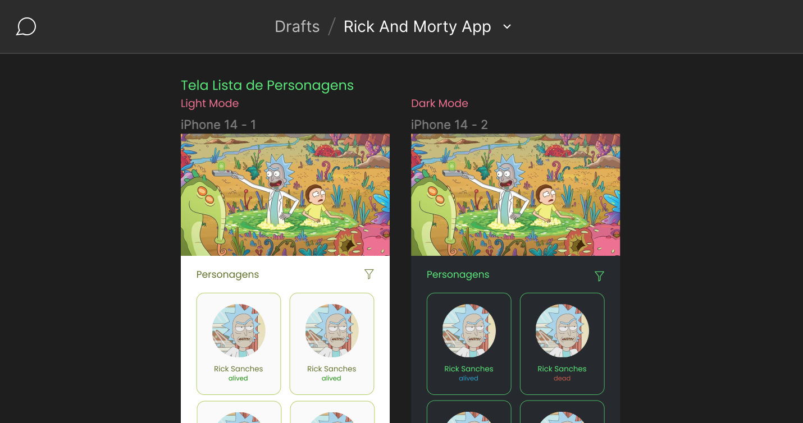

# Evens Taian - Rick & Morty APP/MVVM-C
#### _Using Rick and Morty public API (https://rickandmortyapi.com/)_

Neste projeto escolhi o __MVVM-C__ como padrão de arquitetura, isso me permitiu deixar o código de fácil manutenção, legível, com responsabilidades bem definidas, e pensado em testes (TDD). Isto também possibilitou que esta aplicação fosse construída utilizando os seguintes principios (SOLID):

-  Single Responsibility (Princípio da responsabilidade única)
-  Open-Closed (Princípio Aberto-Fechado)
-  Liskov Substitution (Princípio da substituição de Liskov)
-  Interface Segregation (Princípio da Segregação da Interface)
-  Dependency Inversion (Princípio da inversão da dependência)

### UX/UI

Para visualizar como o projeto deveria parecer, como seria o fluxo das telas e das informações, desenhei o layout da futura aplicação utilizando o figma. Esta visualização prévia foi de grande ajudar pra saber o layout que eu codificaria usando ViewCode.

O design do projeto pode ser encontrado em: 
https://www.figma.com/file/q4ZLtYMfTr1zz5T1VlswhC/Rick-And-Morty-App?type=design&node-id=0%3A1&mode=design&t=jC60kytOU3eVRO1s-1

