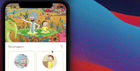
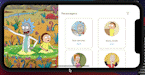

# Evens Taian - Rick & Morty APP/MVVM-C
#### _Using Rick and Morty public API (https://rickandmortyapi.com/)_

Neste projeto escolhi o __MVVM-C__ como padrão de arquitetura, isso me permitiu deixar o código de fácil manutenção, legível, com responsabilidades bem definidas, e pensado em testes (TDD). Isto também possibilitou que esta aplicação fosse construída utilizando os seguintes principios (SOLID):

-  Single Responsibility (Princípio da responsabilidade única)
-  Open-Closed (Princípio Aberto-Fechado)
-  Liskov Substitution (Princípio da substituição de Liskov)
-  Interface Segregation (Princípio da Segregação da Interface)
-  Dependency Inversion (Princípio da inversão da dependência)

Método de desenvolvimento de views: __ViewCode__

### UX/UI

Para visualizar como o projeto deveria parecer e como deveria funcionar o fluxo das telas e das informações, desenhei o layout da futura aplicação utilizando o figma. Esta visualização prévia foi de grande ajuda pra saber que layout eu codificaria usando ViewCode.

O design do projeto pode ser encontrado em: 
https://www.figma.com/file/q4ZLtYMfTr1zz5T1VlswhC/Rick-And-Morty-App?type=design&node-id=0%3A1&mode=design&t=jC60kytOU3eVRO1s-1

### ViewCode
ViewCode é uma abordagem que eu sou pessoalmente favorável. E as razões são várias: fullCode, alta personalização, legibilidade, manutenabilidade, minimo ou facil resolução de conflitos de versionamento. Por isso, neste projeto todos os objetos customizados que compoem uma View devem conformar o protocol _ViewCode_, tornando obrigatório este contrato entre elas. Por exemplo:

<pre>
protocol ViewCode {
    func setupView()
    func setupConstraints()
}

class HeaderComponent: UIView, ViewCode {
    init(){
        setupView()
        setupConstraints
    }
}
</pre>

### Abstrações e Objetos Concretos

Pensando na progressão de manutenções e independencia das classes ao serem testadas, todas as dependencias são feitas por meio de abstrações e não pelo objeto concreto em si. Além do mais, isso respeita o principio de Liskov e o da Inversão de Dependencia. Por exemplo, no projeto isso pode ser visto em:

<pre>
protocol CharactersServicing : AnyObject {
    func getCharacters()
}

class CharactersService : CharactersServicing {
    func getCharacters(){
    }
}

class CharacterViewModel {
    private let service : CharacterDetailsServicing
    
    init(service: CharacterServicing){
        self.service = service
}
</pre>

A viewModel não espera pela implementação concreta, e sim pela abstração dela, representada pelo protocol _CharactersServicing_. Isso permite que uma eventual manutenção aconteça sem que a view model seja drasticamente afetada. E no contexto de testes, permite criar _Spies_ que possam criar implementações especificas ao testar o sut.
### Suporte a Orientação de tela

Esta aplicação remodela o layout sempre que a orientação é mudada. Para isso se tornou necessário sempre crar _NSLayoutsContraints_ especificos para _Portrait_ e _Landscape_ e criar uma manager que ativasse e desativasse essas contraints

### Suporte a DarkMode

Cada cor utilizada na aplicação tem sua versão em Darkmode também.

<pre>
private static func choiceColorWithApparence(_ normalColor: UIColor, _ darkColor: UIColor) -> UIColor {
        if #available(iOS 13.0, *) {
            return UIColor { (traits) -> UIColor in
                return traits.userInterfaceStyle == .dark ?
                   darkColor : normalColor
            }
        } else {
            return normalColor
        }
    }
</pre>

### Network Cache

Fiz controle de cache tanto para as imagens baixadas, quanto para as listas de personagens acessadas. Funcionalmente, to requisição acessa _URLCache_ para verificar se a resposta já se encontra em cache, e somente depois faz a requisição externa.
